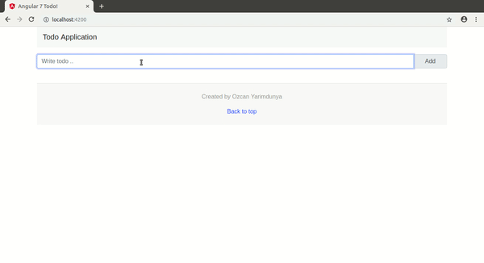

# YourOwnManager

This project was generated with [Angular CLI](https://github.com/angular/angular-cli) version 7.1.4.

## Development server

Run `ng serve` for a dev server. Navigate to `http://localhost:4200/`. The app will automatically reload if you change any of the source files.

## Build

Run `ng build` to build the project. The build artifacts will be stored in the `dist/` directory. Use the `--prod` flag for a production build.

## Extra

##### Used libraries

1. jquery
2. bootstrap
3. popper.js
4. bootstrap-notify
5. @types/bootstrap-notify
6. animate.css

##### Add below configurations to `angular.json > projects > angular7-todo > architect > build > options` object.

```
"styles": [
  "src/styles.css",
  "node_modules/bootstrap/dist/css/bootstrap.min.css",
  "node_modules/animate.css/animate.min.css"
],
"scripts": [
  "node_modules/jquery/dist/jquery.min.js",
  "node_modules/bootstrap/dist/js/bootstrap.min.js",
  "node_modules/bootstrap-notify/bootstrap-notify.min.js"
]
```

## Result


